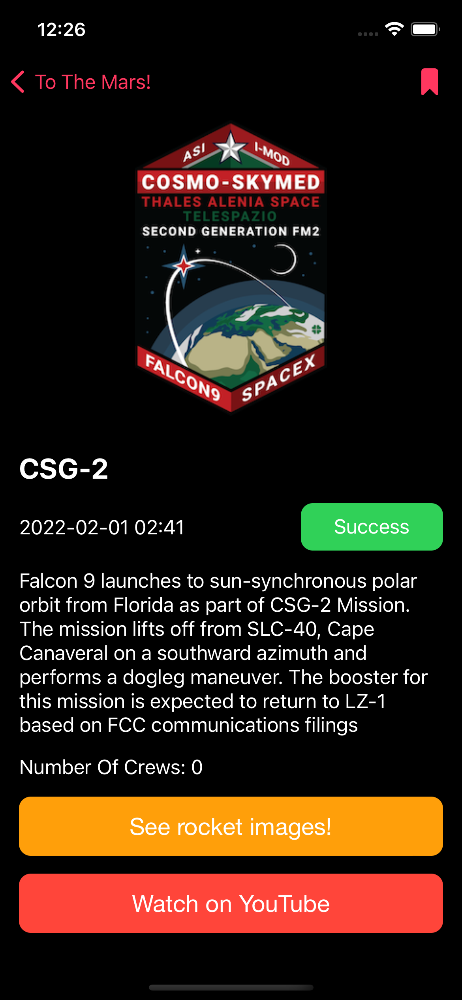

  
  <h1 align="center">Elon Musk Dream</h1>
	<h4 align="center">Using Spacexdata public Api to get information about SpaceX missions 
  </h4>

### Configure the project 🛠

- Clone the project
- Open the __`ElonMuskDream.xcodeproj`__ file with xcode, open the project's file and go to __`Signing & Capabilities`__ and change the __`team`__.
- Build & run.

### Previews 📱

